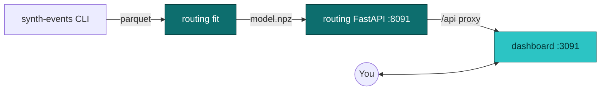

# Dashboard

The interactive UI for the variance-aware routing model. Lives in `ui/dashboard/`, built with Vite + React 19 + TypeScript + Tailwind 4. Audience: data scientists exploring model behavior and engineers reviewing what the routing service is actually doing.

It is **not** the operational dispatch console (that's a separate UI, triggered by a real client routing real pickups -- see [Roadmap](./roadmap)). It is **not** the docs site (that's this site). It's a tool for understanding the model and the policies, not for routing real trays.

## How to access

See [Local development -- Routing model + dashboard demo](./local-development#routing-model--dashboard-demo) for the four-step bring-up. In short:

```bash
# Generate data, fit a model
uv run synth-events generate --n 5000 --out /tmp/journeys.parquet
uv run routing fit --in /tmp/journeys.parquet --out /tmp/routing-model.npz

# Serve the model
ROUTING_MODEL_PATH=/tmp/routing-model.npz \
  uv run uvicorn routing.app:create_app --factory --port 8091

# Run the dashboard
yarn workspace @isl/dashboard dev   # http://localhost:3091
```

## Where it sits



The dashboard makes HTTP calls to the routing service via Vite's `/api` proxy (configured in `ui/dashboard/vite.config.ts`). No state of its own, no backend of its own -- everything dynamic comes from the routing API.

## Tabs

The sidebar has five tabs; **Explorer**, **Operations**, **Backtest**, and **Model** are live; **Calibration** is the last placeholder.

| Tab         | Status      | Backed by                                                                                  |
| ----------- | ----------- | ------------------------------------------------------------------------------------------ |
| Explorer    | **Live**    | `POST /decide` on the routing service                                                      |
| Operations  | **Live**    | `GET /operations/tray-states` and `GET /operations/recent-journeys` on the routing service |
| Backtest    | **Live**    | `GET /backtest/summary` on the routing service                                             |
| Model       | **Live**    | `GET /model/summary` on the routing service                                                |
| Calibration | Placeholder | Will call a future `GET /calibration/reliability` endpoint                                 |

### Explorer (live)

The interactive cell view. Lets you set the pickup parameters and watch all three policies react in real time.

**Controls:**

| Control   | Range / options                                                              |
| --------- | ---------------------------------------------------------------------------- |
| Tray type | Small instrument, Knee, Laparoscopic, Cardiac, Spine -- matches synth-events |
| Client    | Hospital A / B / C, ASC X / Y -- only the proximity policy reads this        |
| Hour      | Slider 0-23. Hours 08-11 and 14-17 trigger the peak-hour effect              |
| Deadline  | Slider 120-360 minutes after pickup                                          |

**On every change**, the dashboard re-POSTs to `/api/decide` and re-renders. Each request triggers fresh posterior-predictive sampling on the server, so the on-time probabilities shift slightly each call (Monte Carlo noise) -- this is real Bayesian uncertainty showing through, not a bug.

**What the cards show:**

- **Three facility cards** -- per-facility expected completion time and predicted P(on-time) under the current cell.
- **Three policy cards** -- which facility each policy picks, plus its candidate scores (P(on-time) for variance-aware, expected minutes for mean-only, 1/0 indicators for proximity).

**Recommended things to try:**

- Slide the deadline from 220 down toward 150. BOCA's P(on-time) collapses fastest because of its high variance. Variance-aware may switch its pick before mean-only does.
- Slide the hour into 08-11 or 14-17. All facilities' expected completions tick up by the peak shift.
- Switch tray type to Spine (1.6x complexity multiplier). All three facilities slow down proportionally; the choice between them often doesn't change.
- Switch the client. Only the proximity policy's pick changes -- the other two are client-independent.

### Operations (live)

The "what's actually happening" view, sourced entirely from the projector's Postgres tables. The page polls both endpoints every 5 seconds.

**Two sections, both rendered as plain tables:**

- **Trays, most recently updated** -- the 50 most-recently-touched rows from the `tray` projection. Columns: tray id, current stage, current facility (colour-coded badge), last event timestamp. As events flow through `ingest -> projector`, rows update on the next poll.
- **Recent finalized journeys** -- the 50 most-recently-delivered rows from the `journey` projection. Columns: tray id, client, facility, tray type, total time (sum of dwells + transport), delay vs. deadline, on-time/late badge.

**When the projector store is empty**, the page shows hint text suggesting `uv run synth-events publish --n 200` to backfill. See [Local development -- Full-stack demo](./local-development#full-stack-demo) for the end-to-end walkthrough.

**When the routing service can't reach Postgres**, the page surfaces the 503 as a "Projector store unreachable" card.

### Backtest (live)

The head-to-head policy comparison rendered from `GET /backtest/summary` -- the routing service runs one simulation against synth-events' true distribution at startup (deterministic given posterior, seed, and N) and caches the result. Sections:

- **On-time rate per policy** -- bar chart, three bars. The point of the model is to beat the proximity baseline by a defensible margin; this is the headline visual.
- **Per-policy aggregates** -- table of on-time rate, mean signed delay, and p95 delay (a tail-risk proxy) for each of the three policies.
- **Lift over baselines** -- table of variance-aware vs mean-only and variance-aware vs proximity, in on-time-rate percentage points. 95% CI from 1000 paired bootstrap resamples. A CI that excludes zero gets a `significant` badge -- that's the "the model helps" signal.

The cached run is sized by the routing service's `ROUTING_BACKTEST_N` env var (default 3000). To recompute against a different N or seed, restart the routing service with new env vars.

### Calibration (placeholder)

What it **will** show:

- Reliability diagram: predicted P(on-time) bin vs. realized on-time rate, with the diagonal showing perfect calibration.
- Calibration drift over time (once we have real data flowing).
- Decomposed views: by tray type, by hour-of-day, by facility.

What it shows today: a card explaining the design.

Why it's not wired yet: calibration only makes sense against real outcomes. With synth-events the model and the data generator agree by construction, so reliability is nearly perfect by definition -- there's nothing to display. This tab gates on the `projector` consumer landing and producing real `journey` rows we can score against.

### Model (live)

Per-parameter posterior summaries rendered from `GET /model/summary` -- the routing service computes these once at startup over the loaded posterior and caches them. Three sections, each a table:

- **Global** -- `mu_global` (baseline log-mean), `gamma_peak` (peak-hour shift), `mu_transport`, `sigma_transport`.
- **Per-facility** -- `alpha[*]` (log-mean offset per facility) and `sigma_facility[*]` (per-facility observation sigma -- the tail-of-the-distribution parameter the variance-aware policy exploits).
- **Per-tray-type** -- `beta[*]` (complexity offset in log-space).

Each row shows mean, posterior SD, and the 90% central credible interval (5th-95th percentile).

**Not shown**: R-hat, effective sample size, and trace plots. The routing service loads the flattened (chains x draws) posterior, so the chain structure is gone by the time we get here. Rerun `uv run routing fit` and inspect the NUTS warnings to check convergence.

## What you CAN do today

| Workflow                                                                                | Where                                      |
| --------------------------------------------------------------------------------------- | ------------------------------------------ |
| See the three routing policies' choices for an arbitrary (tray, hour, deadline, client) | Explorer                                   |
| See per-facility expected completion + P(on-time) under the current cell                | Explorer (facility cards)                  |
| Compare the candidate scores each policy considered                                     | Explorer (policy cards)                    |
| Watch the variance-aware advantage materialize as you tighten the deadline              | Explorer (deadline slider)                 |
| Confirm the peak-hour effect is captured by the model                                   | Explorer (hour slider into 08-12 or 14-18) |
| Verify policy-independence of tray type and client (only proximity reads the client)    | Explorer (switch the dropdowns)            |
| See what the projector has captured (current tray states, recent finalized journeys)    | Operations                                 |
| Watch a live event propagate from POST -> Kafka -> Postgres -> UI                       | Operations (with the live-tracking script) |
| See the bootstrap-CI lift numbers                                                       | Backtest                                   |

## What you CAN'T do yet

| Wanted                                                         | Blocker                                                                                                                      |
| -------------------------------------------------------------- | ---------------------------------------------------------------------------------------------------------------------------- |
| Re-run the backtest with a different N or seed from the UI     | Cached at routing-service startup; changing it means restarting the service with new `ROUTING_BACKTEST_*` env vars           |
| See a reliability diagram                                      | Routing service doesn't expose `GET /calibration/reliability` yet                                                            |
| See R-hat / ESS / trace plots                                  | Posterior is flattened at save time -- chain structure is gone. Need to extend `routing fit` to keep chain ids on disk first |
| See historical _routing decisions_ or audit a routed pickup    | We don't route real pickups yet. Gates on a future dispatch loop writing routing decisions back to the log                   |
| Compare alternative deadline distributions or transport models | No "what-if" framework in the routing API. Would need a new endpoint that re-runs the policy with overridden hyperparameters |
| Save / share a specific cell as a URL                          | No URL-state encoding yet. Trivial to add (React Router search params)                                                       |
| Drill into the posterior for one specific facility / cell      | Not exposed by the API; would surface in the Model tab                                                                       |
| Run the model directly in the browser                          | PyMC + NUTS are server-side. The browser only consumes the JSON output                                                       |

## Architecture notes

- **No persistent state** -- the dashboard is a thin client. Refresh the page and you're back to defaults; URL state encoding is a future addition.
- **No authentication** -- the routing service is unauthenticated. Fine for local dev; needs OAuth2 or similar before it goes anywhere public.
- **Vite proxy** is the integration seam. Local dev points `/api` at `http://localhost:8091`; for production we'd bake the routing API behind a reverse proxy on the same origin so no CORS dance is needed.
- **Posterior is re-sampled per request**, not cached. This is intentional during development so you see the Monte Carlo noise of the inference. For production a request-scoped cache (RNG seeded on the request id) would tighten the output.

## Roadmap

See [Roadmap](./roadmap) for what's built and what's next. Concrete next steps for this UI, in rough order:

1. Wire Calibration tab -- the data is there now (projector emits `journey` rows with `on_time` and `delay_min`); needs a routing-service endpoint that scores each row against the posterior and bins predicted P(on-time) vs realised on-time rate.
2. Forest plot of the posterior parameters on the Model tab (mean + CI brackets) alongside the table.
3. URL-state encoding so a cell can be linked.
4. Plot per-facility completion-time distributions (recharts) overlaid on the Explorer cards, so you can _see_ the variance differences instead of inferring from the P(on-time) number.
