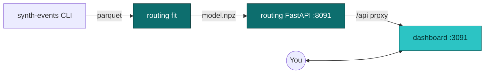

# Dashboard

The interactive UI for the variance-aware routing model. Lives in `ui/dashboard/`, built with Vite + React 19 + TypeScript + Tailwind 4. Audience: data scientists exploring model behavior and engineers reviewing what the routing service is actually doing.

It is **not** the operational dispatch console (that's a separate UI, triggered by a real client routing real pickups -- see [Roadmap](./roadmap)). It is **not** the docs site (that's this site). It's a tool for understanding the model and the policies, not for routing real trays.

## How to access

See [Local development -- Routing model + dashboard demo](./local-development#routing-model--dashboard-demo) for the four-step bring-up. In short:

```bash
# Generate data, fit a model
uv run synth-events generate --n 5000 --out /tmp/journeys.parquet
uv run routing fit --in /tmp/journeys.parquet --out /tmp/routing-model.npz

# Serve the model
ROUTING_MODEL_PATH=/tmp/routing-model.npz \
  uv run uvicorn routing.app:create_app --factory --port 8091

# Run the dashboard
yarn workspace @isl/dashboard dev   # http://localhost:3091
```

## Where it sits



The dashboard makes HTTP calls to the routing service via Vite's `/api` proxy (configured in `ui/dashboard/vite.config.ts`). No state of its own, no backend of its own -- everything dynamic comes from the routing API.

## Tabs

The sidebar has four tabs, three of which are placeholder stubs today.

| Tab         | Status      | Backed by                                                  |
| ----------- | ----------- | ---------------------------------------------------------- |
| Explorer    | **Live**    | `POST /decide` on the routing service                      |
| Backtest    | Placeholder | Will call a future `GET /backtest/summary` endpoint        |
| Calibration | Placeholder | Will call a future `GET /calibration/reliability` endpoint |
| Model       | Placeholder | Will read the posterior summary directly from `model.npz`  |

### Explorer (live)

The interactive cell view. Lets you set the pickup parameters and watch all three policies react in real time.

**Controls:**

| Control   | Range / options                                                              |
| --------- | ---------------------------------------------------------------------------- |
| Tray type | Small instrument, Knee, Laparoscopic, Cardiac, Spine -- matches synth-events |
| Client    | Hospital A / B / C, ASC X / Y -- only the proximity policy reads this        |
| Hour      | Slider 0-23. Hours 08-11 and 14-17 trigger the peak-hour effect              |
| Deadline  | Slider 120-360 minutes after pickup                                          |

**On every change**, the dashboard re-POSTs to `/api/decide` and re-renders. Each request triggers fresh posterior-predictive sampling on the server, so the on-time probabilities shift slightly each call (Monte Carlo noise) -- this is real Bayesian uncertainty showing through, not a bug.

**What the cards show:**

- **Three facility cards** -- per-facility expected completion time and predicted P(on-time) under the current cell.
- **Three policy cards** -- which facility each policy picks, plus its candidate scores (P(on-time) for variance-aware, expected minutes for mean-only, 1/0 indicators for proximity).

**Recommended things to try:**

- Slide the deadline from 220 down toward 150. BOCA's P(on-time) collapses fastest because of its high variance. Variance-aware may switch its pick before mean-only does.
- Slide the hour into 08-11 or 14-17. All facilities' expected completions tick up by the peak shift.
- Switch tray type to Spine (1.6x complexity multiplier). All three facilities slow down proportionally; the choice between them often doesn't change.
- Switch the client. Only the proximity policy's pick changes -- the other two are client-independent.

### Backtest (placeholder)

What it **will** show:

- The lift table from `routing backtest`: per-policy on-time rate, mean delay, p95 delay.
- Bootstrap CIs for variance-aware vs mean-only and vs proximity.
- A bar chart of the on-time-rate comparison.

What it shows today: a card pointing at the design intent and the `routing backtest` CLI.

Why it's not wired yet: the routing service doesn't expose a backtest endpoint. Once `GET /backtest/summary` exists (probably caching one backtest run and serving the result), the tab connects in a few lines.

### Calibration (placeholder)

What it **will** show:

- Reliability diagram: predicted P(on-time) bin vs. realized on-time rate, with the diagonal showing perfect calibration.
- Calibration drift over time (once we have real data flowing).
- Decomposed views: by tray type, by hour-of-day, by facility.

What it shows today: a card explaining the design.

Why it's not wired yet: calibration only makes sense against real outcomes. With synth-events the model and the data generator agree by construction, so reliability is nearly perfect by definition -- there's nothing to display. This tab gates on the `projector` consumer landing and producing real `journey` rows we can score against.

### Model (placeholder)

What it **will** show:

- Posterior summary statistics: facility-level $\alpha$ effects, $\sigma_{\text{facility}}$ estimates, tray-type effects, peak shift.
- Trace plots and R-hat / ESS diagnostics from the fit.
- Posterior predictive overlay vs. observed dwell-time distributions.

What it shows today: a card describing the model.

Why it's not wired yet: the dashboard would need either a `GET /model/summary` endpoint or the ability to read the `.npz` directly. Trivial to add once we decide which path; held off for now to keep this turn's scope contained.

## What you CAN do today

| Workflow                                                                                | Where                                         |
| --------------------------------------------------------------------------------------- | --------------------------------------------- |
| See the three routing policies' choices for an arbitrary (tray, hour, deadline, client) | Explorer                                      |
| See per-facility expected completion + P(on-time) under the current cell                | Explorer (facility cards)                     |
| Compare the candidate scores each policy considered                                     | Explorer (policy cards)                       |
| Watch the variance-aware advantage materialize as you tighten the deadline              | Explorer (deadline slider)                    |
| Confirm the peak-hour effect is captured by the model                                   | Explorer (hour slider into 08-12 or 14-18)    |
| Verify policy-independence of tray type and client (only proximity reads the client)    | Explorer (switch the dropdowns)               |
| See the bootstrap-CI lift numbers                                                       | `uv run routing backtest` CLI, not the UI yet |

## What you CAN'T do yet

| Wanted                                                         | Blocker                                                                                                                      |
| -------------------------------------------------------------- | ---------------------------------------------------------------------------------------------------------------------------- |
| See backtest lift charts in the UI                             | Routing service doesn't expose `GET /backtest/summary`                                                                       |
| See a reliability diagram                                      | No real outcome data yet -- gates on the `projector` + real journey rows                                                     |
| See posterior diagnostics (trace plots, R-hat)                 | Routing service doesn't expose `GET /model/summary`. Easy add when we decide the format                                      |
| See historical decisions or audit a routed pickup              | We don't route real pickups yet. Gates on the routing service running against real ingest events                             |
| Compare alternative deadline distributions or transport models | No "what-if" framework in the routing API. Would need a new endpoint that re-runs the policy with overridden hyperparameters |
| Save / share a specific cell as a URL                          | No URL-state encoding yet. Trivial to add (React Router search params)                                                       |
| Drill into the posterior for one specific facility / cell      | Not exposed by the API; would surface in the Model tab                                                                       |
| Run the model directly in the browser                          | PyMC + NUTS are server-side. The browser only consumes the JSON output                                                       |

## Architecture notes

- **No persistent state** -- the dashboard is a thin client. Refresh the page and you're back to defaults; URL state encoding is a future addition.
- **No authentication** -- the routing service is unauthenticated. Fine for local dev; needs OAuth2 or similar before it goes anywhere public.
- **Vite proxy** is the integration seam. Local dev points `/api` at `http://localhost:8091`; for production we'd bake the routing API behind a reverse proxy on the same origin so no CORS dance is needed.
- **Posterior is re-sampled per request**, not cached. This is intentional during development so you see the Monte Carlo noise of the inference. For production a request-scoped cache (RNG seeded on the request id) would tighten the output.

## Roadmap

See [Roadmap](./roadmap) for the planned milestones. Concrete next steps for this UI, in rough order:

1. Wire Backtest tab -- needs `GET /backtest/summary` on the routing service.
2. Wire Model tab -- needs `GET /model/summary` on the routing service.
3. URL-state encoding so a cell can be linked.
4. Plot per-facility completion-time distributions (recharts) overlaid on the Explorer cards, so you can _see_ the variance differences instead of inferring from the P(on-time) number.
5. Wire Calibration tab -- gated on real outcome data from the projector.
