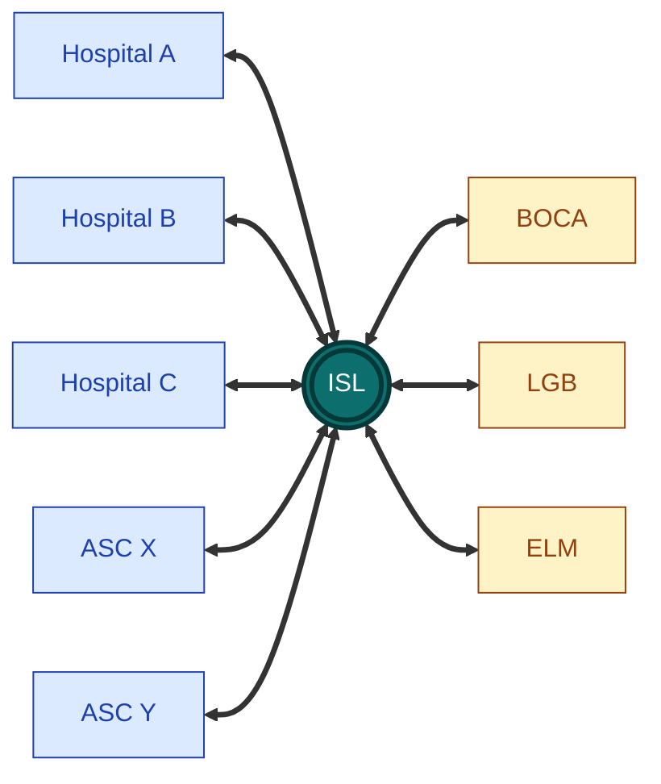

# Instrument Sterilization Logistics

**Cross-facility coordination layer for offsite surgical-instrument reprocessing networks.**

## What this is

A network of $N$ sterilization facilities reprocesses surgical trays for $M$ client hospitals and <abbr title="Ambulatory Surgery Centers -- outpatient surgical facilities">ASCs</abbr>. Each tray clears the pipeline (decon -> inspection -> assembly -> sterilization -> packout -> transport), then returns by a deadline tied to the next <abbr title="Operating Room">OR</abbr> case.

For each pickup in that flow, ISL:

1. **Routes** the pickup to the facility most likely to hit the next <abbr title="Operating Room">OR</abbr>-case deadline -- variance-aware, not mean-aware.
2. **Reports** contractually defensible <abbr title="Service-Level Agreement">SLA</abbr> performance across all facilities for each client.
3. **Learns** the real composition of each tray type from observed reprocessing data, and uses that to forecast demand and pre-stage trays.
4. **Audits** the cross-facility journey of every tray with a regulatory-grade trail (<abbr title="U.S. Food and Drug Administration">FDA</abbr>, <abbr title="Association for the Advancement of Medical Instrumentation">AAMI</abbr> <abbr title="AAMI ST79 -- comprehensive guide to steam sterilization and sterility assurance">ST79</abbr>, Joint Commission, state licensing).

Without this layer the relationship is $M \times N$ point-to-point integrations and a different SLA report per client. With it, everyone talks to a single coordination plane.

## What this is _not_

This is deliberately not a competitor to the single-facility <abbr title="Sterile Processing Department -- the hospital function that cleans, inspects, assembles, sterilizes, and packages surgical instruments">SPD</abbr> systems already deployed in the industry (CensiTrac, SPM, ...). Where a facility runs one of those, we integrate with it; we do not replace it. The wedge is in the **cross-facility** problems those systems are not designed to solve.

## How it's built

The system is event-sourced end to end. The Kafka topic `events` is the source of truth; current state -- where each tray is, the journey it's followed, the SLA report for each client -- is a [projection](#what-current-state-is-a-projection-means) rebuilt from the log by downstream consumers. This makes the system replayable, auditable, and easy to extend with new consumers without breaking existing ones.

The stack today:

- **Redpanda** -- Kafka API + Schema Registry in a single binary, the event bus
- **FastAPI** -- for the [ingest service](services/ingest) (validates events, derives a deterministic UUIDv5, publishes to Kafka) and the [routing service](services/routing) (serves the Bayesian model to the dashboard)
- **PyMC** -- the hierarchical Bayesian routing model (per-facility partial pooling, posterior-predictive scoring)
- **Postgres** -- the projection store the [`projector`](services/projector) consumer writes to. Not load-bearing; wipe it and replay the log
- **Vite + React + Tailwind** -- the [dashboard](dashboard), wired to the routing service via Vite's `/api` proxy
- **Docusaurus** -- this docs site

Planned, not yet built:

- **S3** -- the immutable long-term archive, written by the Kafka Connect S3 sink

Flink, Snowflake, and TimescaleDB are graduated _to_ only when a specific workload demands them -- see [Roadmap](roadmap) for the triggers.

## What "current state is a projection" means

The Kafka topic `events` is the only source of truth. Everything else -- where each tray is right now, the full journey of a tray, the SLA report for each client -- is a **projection**: a view derived from the log by replaying events in order.

Concretely, the [`projector`](services/projector) consumer reads `events` and writes the current tray state and per-tray journey into Postgres. Future readers (the dashboard, the SLA report) read from those tables. If the projection logic has a bug, the fix is: change the consumer, drop the affected Postgres tables, and replay the log from offset 0. The truth doesn't move; only the view of it does.

This is what keeps the system extensible. A new consumer -- a fraud detector, a new SLA contract shape, an ML training pipeline -- is just another reader of the same log: no upstream change required, and the new consumer backfills its own state by replaying history.

## Where to go next

- **[Local development](local-development)** -- bring up the stack and run the routing demo end-to-end (no Docker needed for the modeling flow)
- **[Ingest service](services/ingest)** -- the front door for events
- **[Synthetic events](services/synth-events)** -- generates training data before real-client data exists
- **[Routing model](services/routing)** -- the Bayesian model, three policies, and the simulation harness
- **[Projector](services/projector)** -- Kafka consumer that projects events into Postgres `tray` and `journey` tables
- **[Dashboard](dashboard)** -- interactive UI: what's live, what's stubbed, what each tab is for
- **[Roadmap](roadmap)** -- what's built, what's next, and what's deliberately not built yet (with the trigger that would change that)
- **[Glossary](glossary)** -- acronyms (SPD, EHR, HL7, ...) and project-specific terms
