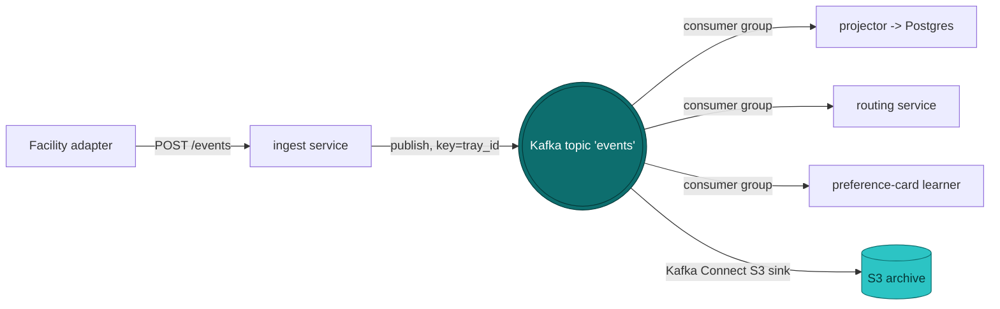

# `services/ingest`

The **front door** for events from the outside world. Facility <abbr title="Sterile Processing Department">SPD</abbr> systems (CensiTrac, SPM, ...), hospital <abbr title="Electronic Health Records">EHRs</abbr>, and transport vendors all eventually call one endpoint on this service: `POST /events`. The service validates, derives a stable identifier, and publishes to a Kafka topic. That's it.

Per the design doc, this is the M1 event spine. Everything else in the system -- projections, routing, SLA reporting, the long-term audit archive -- is a consumer of the topic this service writes to.

## What it does

For each inbound event, the service does three things, in order:

1. **Validates the shape.** A strict Pydantic model rejects anything malformed or with unknown fields. Missing required fields, empty strings, bad enum values -> `422 Unprocessable Entity`. Nothing reaches the topic.
2. **Derives a deterministic `event_id`.** A UUIDv5 computed from `(source_system, source_event_id)` using a stable project namespace. The same inputs always produce the same UUID -- this is the dedup mechanism (see [Idempotency](#idempotency)).
3. **Publishes to Kafka.** One message to the `events` topic, partition key = `tray_id` (preserves per-tray ordering), value = the event encoded in the Confluent JSON-Schema wire format (magic byte + schema ID + JSON body), schema registered to Schema Registry on first publish.

That's the whole service. No database, no S3 in the write path -- those are downstream consumer concerns.

## Architecture



Properties this architecture gets for free:

- **Replay from any offset** -- new consumers backfill by reading from offset zero, no historical scan against a database.
- **Native consumer groups** -- multiple replicas of the same consumer split partitions automatically. No hand-rolled `claimed_by` columns.
- **Schema enforcement at the wire** -- Schema Registry rejects publishes whose schema breaks forward/backward compatibility. Producers and consumers stay aligned without manual coordination.
- **Long-term archive is a connector, not application code** -- Kafka Connect S3 sink writes day-partitioned objects to S3 with no involvement from the ingest service.

## API

### `POST /events`

Submit one event. Returns `202 Accepted` on successful publish.

**Request body:**

```json
{
  "source_system": "CENSITRAC_BOCA",
  "source_event_id": "abc-123",
  "tray_id": "TRAY-001",
  "facility_id": "BOCA",
  "event_type": "CHECKED_IN",
  "timestamp_event": "2026-05-25T14:30:00+00:00",
  "operator_id": "tech_42",
  "payload": { "any": "JSON" },
  "schema_version": 1
}
```

**Response:**

```json
{
  "event_id": "8b1a1f4c-0d4e-5e0a-9b1f-1c0e0a1b2c3d"
}
```

Notice there is no `inserted` field. The ingest service does not know whether this is a first publish or a retry -- and it doesn't matter, because the deterministic `event_id` means downstream consumers naturally dedup on it. If the vendor retries the same `source_event_id`, the response will return the same `event_id`; the message lands on Kafka twice; the projector's `INSERT ... ON CONFLICT (event_id) DO NOTHING` (or equivalent) handles the duplicate.

**Validation failure:** standard FastAPI `422` with field-level detail.

### `GET /healthz`

Liveness probe. Returns `{"status": "ok"}` and `200`. Does not check the broker -- for readiness, query the broker directly from the orchestrator.

## The event model

Defined in [`src/ingest/events.py`](https://github.com/caverac/instrument-sterilization-logistics/tree/main/services/ingest/src/ingest/events.py). The Kafka schema, defined in [`src/ingest/bus.py`](https://github.com/caverac/instrument-sterilization-logistics/tree/main/services/ingest/src/ingest/bus.py), mirrors it.

| Field              | Type          | Constraint                  | Notes                                                                         |
| ------------------ | ------------- | --------------------------- | ----------------------------------------------------------------------------- |
| `event_id`         | UUID          | server-assigned (UUIDv5)    | Derived from `(source_system, source_event_id)`. Never accepted from client   |
| `source_system`    | str           | 1--64 chars                 | Vendor system identifier (e.g. `CENSITRAC_BOCA`)                              |
| `source_event_id`  | str           | 1--128 chars                | Vendor's own ID. Other half of the dedup key                                  |
| `tray_id`          | str           | 1--64 chars                 | Catalog identifier. Used as Kafka partition key                               |
| `facility_id`      | str           | 1--64 chars                 | Where the event occurred                                                      |
| `event_type`       | enum          | one of the lifecycle states | `PICKED_UP`, `CHECKED_IN`, `DECON_START`, ..., `DELIVERED`, `DEFECT_REPORTED` |
| `operator_id`      | str \| null   | `<= 64 chars`               | Optional                                                                      |
| `timestamp_event`  | datetime (tz) | required                    | When the event happened at the source                                         |
| `timestamp_ingest` | datetime (tz) | server-assigned             | When we received it                                                           |
| `payload`          | jsonb         | default `{}`                | Opaque to the ingest service                                                  |
| `schema_version`   | int           | `>= 1`, default 1           | Increment on incompatible schema change                                       |

The Pydantic model uses `extra="forbid"`, so unknown fields are rejected at the HTTP boundary. Schema Registry enforces the same contract on the wire.

## Idempotency

The `event_id` is **derived**, not minted. Specifically:

```
event_id = uuidv5(project_namespace, f"{source_system}:{source_event_id}")
```

Two consequences:

- **Vendor retries are transparent.** A retry produces the same `event_id`, lands on Kafka again, gets dedupped by consumers writing with `ON CONFLICT (event_id) DO NOTHING` or equivalent. The producer does not need to track which events it already sent.
- **At-least-once delivery is sufficient.** Neither ingest nor Kafka needs exactly-once semantics, because the consumer-side dedup makes redelivery a no-op. This simplifies the entire pipeline.

The `(source_system, source_event_id)` key is owned by the vendor. We honor whatever idempotency the source already maintains.

For sources that genuinely cannot supply a stable `source_event_id`, this design will produce duplicates. The fix is upstream (the adapter generates a stable ID from its own context), not in ingest.

## Why Kafka (Redpanda)

Kafka gives us four properties as broker primitives that any event-driven system eventually needs:

- **Durable log.** Every message persists on disk for the topic's retention window. New consumers backfill by reading from offset zero -- no historical scan against a database.
- **Consumer groups.** Multiple replicas of a consumer split partitions automatically. No hand-rolled `claimed_by` columns or leader-election logic to scale a consumer horizontally.
- **Independent consumer offsets.** Adding a new consumer service does not affect existing ones. Each tracks its own position in the log.
- **Idempotent producer + transactional semantics.** Combined with the deterministic `event_id`, at-least-once delivery is sufficient -- redelivery is a no-op at the consumer's projection write.

**Redpanda over vanilla Kafka** because: same API, no Zookeeper, single Go binary (~50 MB), runs in one container in local dev. Same operational ceiling: if we ever want managed (MSK, Confluent Cloud, Aiven), swap the broker, application code unchanged.

## Configuration

All settings come from environment variables prefixed `INGEST_`.

| Variable                     | Default                  | Notes                                    |
| ---------------------------- | ------------------------ | ---------------------------------------- |
| `INGEST_KAFKA_BROKERS`       | `localhost:19092`        | Comma-separated bootstrap servers        |
| `INGEST_SCHEMA_REGISTRY_URL` | `http://localhost:18081` | Confluent-compatible Schema Registry URL |
| `INGEST_KAFKA_TOPIC`         | `events`                 | Target topic for published events        |

The producer is configured with:

- `enable.idempotence: true` -- broker dedups by `(producer_id, sequence_number)` during retries
- `acks: all` -- wait for all in-sync replicas
- `compression.type: snappy` -- fast compression, ~3x reduction on JSON payloads
- `linger.ms: 5` -- small batching window for throughput; bounded so per-event latency stays low

## Local development

See [Local development](../local-development) for stack setup (`make dev-up`, Redpanda Console, the end-to-end POST walkthrough, troubleshooting). To run just this service against an already-up stack:

```bash
uv run uvicorn ingest.app:create_app --factory --reload --port 8000
```

## Testing

The service holds itself to **100% unit-test coverage** (`pytest --cov-fail-under=100`).

### Unit tests

Inject `FakeProducer` and `FakeSerializer` via FastAPI's `app.dependency_overrides`. No broker required.

```bash
uv run pytest services/ingest -m "not slow"
```

### Integration tests

Mark with `@pytest.mark.slow`. They drive the real `docker-compose` stack: POST an event, then read it back from Redpanda via a `Consumer` and decode it with the Schema-Registry-aware `JSONDeserializer`. They also verify the schema is registered under `<topic>-value` and that two POSTs with the same `(source_system, source_event_id)` return the same `event_id`.

```bash
make dev-up
uv run pytest services/ingest -m slow
```

See the project [Roadmap](../roadmap) for M1--M3 build order, the full out-of-scope table, and the triggers that move ingest itself toward Avro encoding, managed Kafka, OAuth2, and horizontal scaling.
