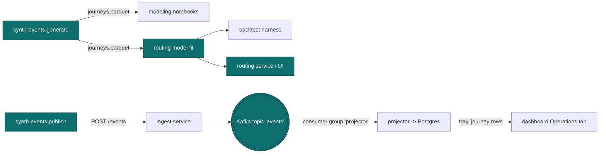

# `services/synth-events`

Generates synthetic journey rows for modeling and demo work. Produces parquet output shaped like what the future `projector` service will emit, so downstream consumers (notebooks, the routing model, the backtest harness) can be built and evaluated before real client data exists.

This package is **development tooling**, not part of the live pipeline. It does not publish to Kafka or run in production.

## What it produces

One row per **journey** -- a complete pickup-to-return cycle for one tray. The schema mirrors what the real `projector` service will write to Postgres, so anything trained on synthetic output runs unchanged on real data.

| Column                    | Type             | Notes                                                                      |
| ------------------------- | ---------------- | -------------------------------------------------------------------------- |
| `journey_id`              | UUID             | Stable identifier; deterministic given the RNG seed                        |
| `facility_id`             | str              | One of `BOCA`, `LGB`, `ELM`                                                |
| `tray_id`                 | str              | Synthesized identifier                                                     |
| `tray_type_id`            | str              | One of 5 tray types of varying complexity                                  |
| `client_id`               | str              | Hospital or ASC identifier                                                 |
| `pickup_ts`               | datetime (UTC)   | When the tray left the hospital                                            |
| `required_by_ts`          | datetime (UTC)   | Deadline (next OR-case start)                                              |
| `decon_dwell_min`         | float            | Per-stage dwell time, sampled from a log-normal per facility / tray / hour |
| `inspection_dwell_min`    | float            |                                                                            |
| `assembly_dwell_min`      | float            |                                                                            |
| `sterilization_dwell_min` | float            |                                                                            |
| `packout_dwell_min`       | float            |                                                                            |
| `transport_min`           | float            | Return trip from facility back to client                                   |
| `delivered_ts`            | datetime (UTC)   | `pickup_ts + sum(dwells) + transport_min`                                  |
| `on_time`                 | bool             | `delivered_ts <= required_by_ts`                                           |
| `delay_min`               | float            | Signed: positive = late                                                    |
| `hour_of_pickup`          | int (0-23)       | Hour-of-day at pickup                                                      |
| `day_of_week`             | int (0-6, Mon=0) |                                                                            |

## Distribution design

Three facilities, with **deliberately different (mean, variance) profiles**. This is the property that makes variance-aware routing measurably beat mean-only routing in the backtest:

| Facility | Mean total time | Variance multiplier | Story                                  |
| -------- | --------------- | ------------------- | -------------------------------------- |
| `BOCA`   | ~155 min        | 1.5x                | Newest, fast on average, unpredictable |
| `LGB`    | ~165 min        | 1.0x                | Mature operation, consistent           |
| `ELM`    | ~185 min        | 0.5x                | Constrained but very steady            |

A mean-only router always picks BOCA (lowest mean). A variance-aware router picks LGB for tight deadlines, BOCA for slack ones. The whole point of the model is to discover when each strategy applies.

Per-stage dwell times are **log-normal**: stage means scale uniformly so the per-(facility, tray, hour) journey mean matches a target, and stage sigmas scale with the facility's variance multiplier. Peak-hour pickups (08-12 and 14-18) take an additional 15 min of queueing. Tray complexity is a multiplicative shift on the journey mean.

Empirically on 10,000 generated journeys with a uniform mix of trays and pickup times:

```
BOCA: n=3327  mean=186.7min  std=59.6min  on_time_rate=52.90%
LGB:  n=3335  mean=196.9min  std=53.8min  on_time_rate=47.35%
ELM:  n=3338  mean=216.7min  std=51.4min  on_time_rate=36.31%
```

The variance ranking holds (59.6 > 53.8 > 51.4), and the on-time-rate ranking matches the mean ranking under the chosen deadline distribution. Tightening the deadline slack collapses BOCA's lead (its variance bites) and makes the LGB choice obvious for at-risk pickups -- the headline result the routing model is designed to reproduce.

## Where it fits



The two synth-events surfaces serve different audiences:

- **`generate`** writes parquet for offline modeling. Not part of the live pipeline; the routing model fits on it today and will switch to the projector's Postgres tables once real client data accumulates.
- **`publish`** POSTs events through ingest so the projector, dashboard, and any future consumer have realistic data to work against without waiting for real-client onboarding. Pure dev tooling -- never run in production.

## CLI

### `synth-events generate`

Writes synthetic journeys to a parquet file. Reproducible from the seed -- identical seed + flags produce identical bytes, which matters for backtests with a fixed evaluation set.

```bash
uv run synth-events generate --n 10000 --out journeys.parquet --seed 42 --days 30
```

| Flag     | Default            | Notes                                                            |
| -------- | ------------------ | ---------------------------------------------------------------- |
| `--n`    | `10000`            | Number of journeys to generate                                   |
| `--out`  | `journeys.parquet` | Output file path                                                 |
| `--seed` | `42`               | RNG seed -- same seed produces byte-identical parquet output     |
| `--days` | `30`               | Time span (days) ending at `2026-01-01` to spread pickups across |

### `synth-events publish`

Generates N journeys and POSTs every event (10 per journey, in order) through the ingest service. Useful for backfilling the projector + dashboard with realistic data before any real client onboards.

```bash
uv run synth-events publish --n 200 --hours 24 --seed 1
# expected: "posted 2000 events from 200 journeys to http://localhost:8000"
```

| Flag           | Default                 | Notes                                                  |
| -------------- | ----------------------- | ------------------------------------------------------ |
| `--n`          | `200`                   | Number of journeys to publish                          |
| `--ingest-url` | `http://localhost:8000` | Ingest service base URL                                |
| `--seed`       | `42`                    | RNG seed for reproducibility                           |
| `--hours`      | `24`                    | Spread pickup times across the last N hours ending now |

#### Event timeline

Each journey is mapped to 10 events. Timestamps are chosen so the **projector's computed per-stage dwells equal the Journey's dwell fields exactly**, and the projector's `journey.delivered_ts` equals the original `Journey.delivered_ts`:

- `PICKED_UP`, `CHECKED_IN`, `DECON_START` collapse onto `pickup_ts` (no transit/queue modelled).
- `DECON_END = pickup_ts + decon_dwell_min`.
- Each subsequent stage end is the previous stage end plus that stage's dwell.
- `PACKED`, `LOADED` collapse onto `pickup_ts + sum(dwells)` (no separate loading dwell).
- `DELIVERED = LOADED + transport_min`.

`POST /events` is called sequentially per journey to preserve per-tray ordering. Failures are loud -- the CLI aborts with a `ClickException` rather than silently dropping data.

## Library use

The CLI is a thin wrapper around library functions you can call directly from a notebook or another service:

```python
import numpy as np
from datetime import datetime, timedelta, timezone

from synth_events.journey import simulate_journey
from synth_events.parquet import read_journeys_records, write_journeys_parquet
from synth_events.schedule import generate_pickups

rng = np.random.default_rng(42)
end = datetime(2026, 1, 1, tzinfo=timezone.utc)
start = end - timedelta(days=30)

pickups = generate_pickups(rng, n=10_000, start=start, end=end)
journeys = [simulate_journey(rng, p) for p in pickups]

write_journeys_parquet(journeys, "journeys.parquet")
```

For reading parquet output, use the typed helpers in `synth_events.parquet` (they wrap `pyarrow.parquet` so callers do not need to touch untyped pyarrow APIs directly):

```python
from synth_events.parquet import read_journeys_records, read_journeys_table

table = read_journeys_table("journeys.parquet")     # pyarrow.Table, for schema + zero-copy ops
records = read_journeys_records("journeys.parquet") # list[dict], for plain Python use
```

## Testing

```bash
cd services/synth-events && uv run python -m pytest tests/ -v
```

100% line coverage is enforced. The test suite includes statistical assertions on the generator itself:

- Empirical mean of sampled journey totals lands within 2% of the analytic target (validates the log-normal `mu` correction)
- Empirical std-dev ordering matches the designed variance ranking (BOCA > LGB > ELM)
- Empirical transport-time mean matches `TRANSPORT_MEAN_MIN` within 2%
- Same seed + same flags -> identical parquet bytes

These guard against silently breaking the distributional assumptions the downstream modeling work depends on.
